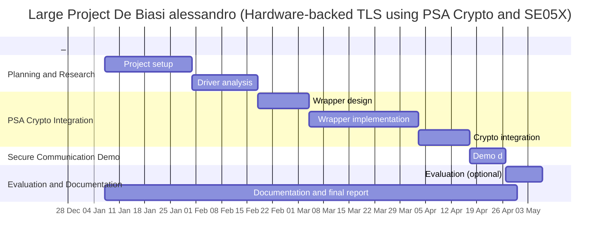

## Project Objective

The objective of this project is to design and implement a hardware-backed cryptographic architecture for embedded systems based on Arm PSA Crypto, mbed TLS, and the NXP SE050 secure element, using the Arduino Portenta H7 or Portenta C33 as the target platform.
The work builds on an existing [SE05X](https://github.com/matthias-ku/SE05X_Final) driver developed by previous [AAU](https://www.aau.at/) students, which provides low-level access to the secure element functionality (eg. function to compute AES and RSA mainly). This existing implementation will be used as a baseline and reference, while the core contribution of this project focuses on building a wrapper to have a standard-compliant cryptographic abstraction rather than on low-level hardware communication.
The main contribution will consists in developing a PSA-compatible cryptographic driver that transparently offloads sensitive cryptographic operations, such as key generation, asymmetric signing, and symmetric encryption, from software to the secure element. In this architecture I plan to have the private keys generated, stored, and used exclusively inside the SE050, and never exposed them to the main microcontroller memory.
As a practical use case, the system will be validated through a TLS-secured MQTT communication between the Portenta board, acting as a secure IoT client, and a Raspberry Pi 4 MQTT broker. This demonstration will show end-to-end authentication and encryption backed by hardware-protected keys.
If time permits, I would like the project to also include a comparative evaluation between the hardware-backed TLS implementation and a traditional software-only TLS stack, focusing on performance, memory usage, CPU load, and security properties.

---

## Required Hardware

The hardware requirements for the project are minimal:

- One Arduino Portenta H7 or Arduino Portenta C33

- One device which will be used as MQTT broker and test endpoint, in this case i will use a Raspberry Pi 4.

---

## Project Schedule

The project will be structured into the following phases as described in the gantt after this section:

### Phase 1: Planning and Research

#### Sub-Phase 1: Research and Environment Setup

Configuration of the development environment, analysis of the existing SE05X driver implementation, study of mbed OS and zhephyr (that seems more used and modern but is less documented), mbed TLS (that will be the tls abstraction lib that I plan to use), and PSA Crypto standard and how it works, and selection of the MQTT/TLS software stack.

#### Sub-Phase 2: Secure Element and Driver Analisys

Validation of SE050 cryptographic capabilities using the existing [driver](https://github.com/matthias-ku/SE05X_Final) as a baseline, testing of key generation, signing, verification, and encryption primitives, and verification of secure key storage and access constraints and driver analisys.

### Phase 2: PSA Crypto Driver Integration

Design and implementation of a PSA-compatible wrapper for the SE050 over the [SE05X driver](https://github.com/matthias-ku/SE05X_Final), mapping of PSA key attributes and policies to secure element objects, enforcement of key opacity and usage restrictions, and integration with mbed TLS through the PSA Crypto layer.

### Phase 3: Secure Communication Demonstration

Development of an MQTT client example running on the Portenta board, TLS client authentication using keys stored in the secure element, and end-to-end encrypted and authenticated communication with a MQTT broker.

### Phase 4
#### Sub-Phase 1: Performance and Security Evaluation (optional)

Measurement of memory usage, CPU load, and latency, comparison with a software-only TLS implementation, and qualitative discussion of the resulting security properties.

#### Sub-Phase 2: Documentation and Finalization

Preparation of the final report for the large project, will mostly be done in parallel to the project.

---
## Gantt of the Project

---
## Large Project Writeup
You can find the full writeup of this project either in the [documentation folder]() or at this [Overleaf link](https://www.overleaf.com/read/ptbwqxwbtbks#01d24c) 
---

## References and Initial Resources

- Existing SE05X driver implementation used as baseline:
  https://github.com/matthias-ku/SE05X_Final

- Zephyr main page:
  https://www.zephyrproject.org/

- mbed TLS documentation and source code:
  https://github.com/Mbed-TLS/mbedtls

- Discussion on secure element integration with TLS stacks:
  https://github.com/zephyrproject-rtos/zephyr/discussions/74217

- Tutorials on mbedOS:
  https://os.mbed.com/docs/mbed-os/v6.8/tutorials/index.html
